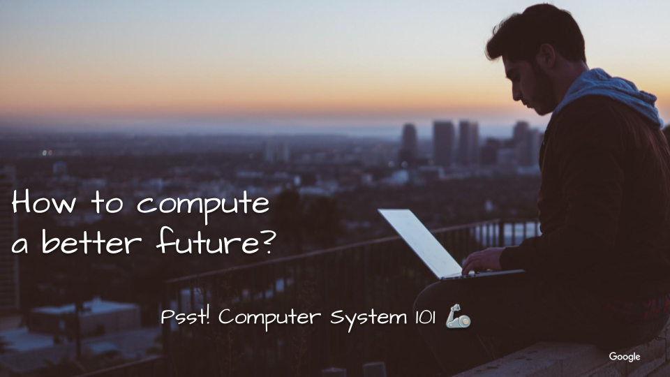

# Android System Development On The Cloud
tl;dr How we may level the playing field for better divested CS talent pipelines.

- [ASD code labs](codelabs.md) are developed as a workshop for
[Google's Code Next](https://codenext.withgoogle.com/). Which works with
high schoolers to cultivate the next generation of Black and Latinx tech leaders.
- It'll continuously develop in open. So that any passionate in bootstrapping CS talent
pipeline in their community can use them.
- Any contribution is welcome. Let's make a dent in the consumer computing universe by getting more started.

## Why
- How may we expand the future diversified talent pipeline for Tech.?
- How can we level the playing field by removing the entry barriers? What if students do not need a powerful computer?
- How to work from anywhere easier?

### Why Now
Because
- [CS-literacy is a skill in high demand](https://samlin001.medium.com/stay-open-push-forward-a64ef27c91f0).
But the talent gap is widering.
- [The New Age Of Software-Defined](https://samlin001.medium.com/the-new-age-of-software-defined-2ae97c6d3281)
is just getting started.

## How
- Coaches from Tech. to share their CS journeys to share what's like to work in
Tech. & be a role model to inspire high schoolers.
- Introduction to Computer System 101 to show how theories power our digital lives.
- Practical code labs to build Android Virtual Device on Google Cloud Platform
for a taste of [the next-generation development workflows](https://medium.com/geekculture/wwdc21-minority-report-ac4b531a0035)
& a bit of hands-on satisfaction.

## Key Outcomes
- Set up a developer machine on the cloud by a Browser anywhere.
- Build an Android Phone on the cloud.
- Create & customize your Android Phone on the cloud.

## Agenda
A typical workshop can be planned as:
- 30min. Meet Coaches
- 30min. CS 101
- 40min. Code Lab 1
- 40min. Code Lab 2
- 40min. Code Lab 3

You can also plan a minimal workshop for 2 hours. Becuase students should be
able to complete the rest code labs on their own after that.

## What do students need to join the workshop?
- Ready to join [Google Meet meeting](https://apps.google.com/meet/).
- Ready to [Get started for free](https://cloud.google.com/pricing) for Google
Cloud Platform.
- Curious to learn & interst to explore next-generation computing system
development model.
