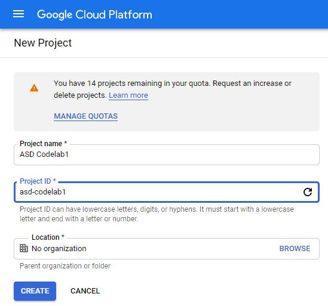
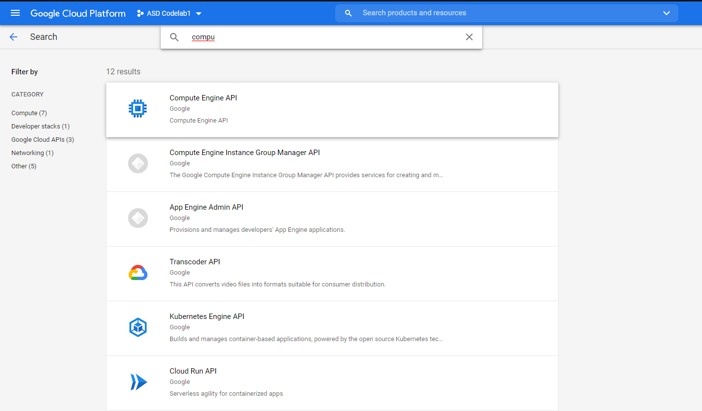
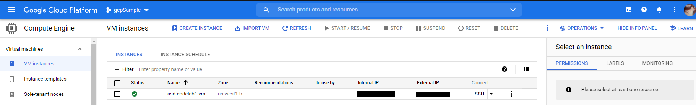
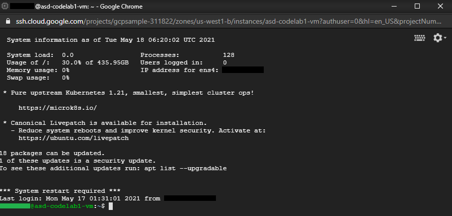
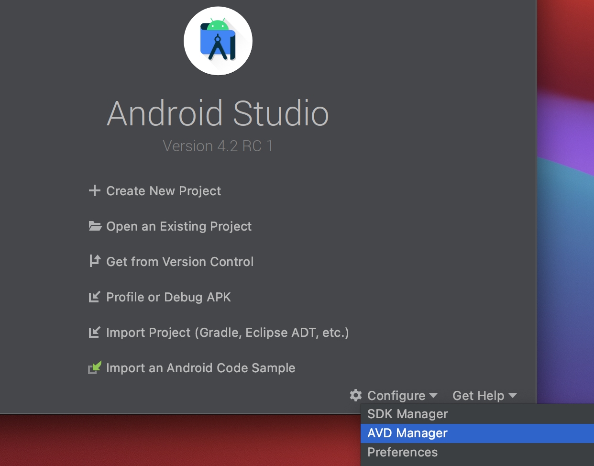
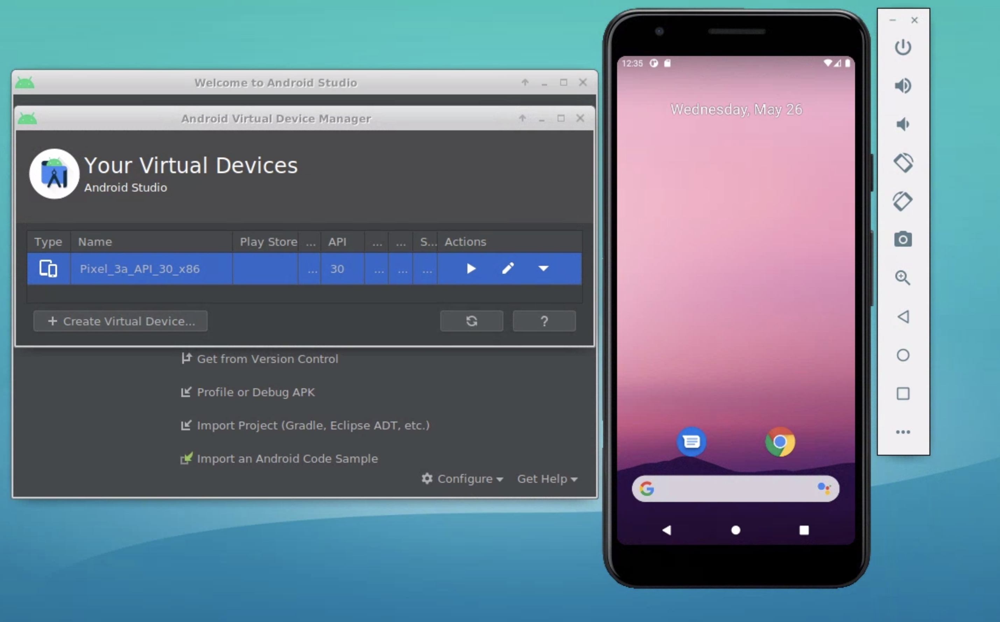
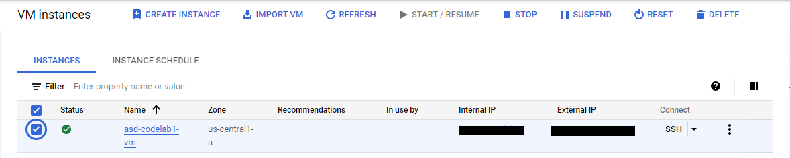

# Set Up a System Development Environment on the Cloud
In this code lab, you will learn how to create a virtual machine on
Google Cloud Platform(GCP) and access it by Chrome Remote Desktop(CRD) for
Android system development.

## Android developement on the cloud


## Create a new GCP project
In this example, we will create a new project: **ASD Codelab1**.
Alternatively, You can use an existing project if it fits better.

1. Follow the instructions for [Creating a project](https://cloud.google.com/resource-manager/docs/creating-managing-projects#creating_a_project)
    - Project name: **ASD Codelab1**
    - Keep the Project ID handly as it's the unique identifier for your projec.
    **my-project-id** is used as the example. Which should be replaced with the
    actual Project ID.



2. If you never enable billing, [Enable billing](https://cloud.google.com/billing/docs/how-to/modify-project#enable_billing_for_a_project)
first. So, you can proceed the following steps.

3. Enable Compute Engine API
    - In [GCP Console](http://console.cloud.google.com/), select the project: **ASD Codelab1**
    - Search **compute** to select **Compute Engine API**
    - Select **Enable**




4. Check the project by [Cloud Shell](https://cloud.google.com/shell)
    - Read [Using Cloud Shell](https://cloud.google.com/shell/docs/using-cloud-shell)
    if Cloud Shell is new to you.
    - Take the time to get familiar with
    [Running gcloud commands with Cloud Shell](https://cloud.google.com/shell/docs/running-gcloud-commands),
    because you are going to use it a lot in the code labs.
    - To verify if the project exists, you can list & grap the ID in [Cloud Shell Editor](https://shell.cloud.google.com)
     as:
```
export PROJECT_ID="asd-codelab1"
gcloud projects list | grep ${PROJECT_ID}

echo "Set the defult project for the section"
gcloud config set project ${PROJECT_ID}
```

## Create a VM
Now, let's create a VM with a custom image for development. By using a custom
image you can skip many set up setps. In this example, we use a custom image
with all the software required for Android system development:
  - Linux: ubuntu 18.04
  - Python 2.7 as repo depend on it.
  - Set up for [Downloading Android Source](https://source.android.com/setup/build/downloading)
  - [Android Studio 4.2.1](https://developer.android.com/studio)


### Steps
1. Read [Create a VM from a custom image](https://cloud.google.com/compute/docs/instances/create-start-instance#create_a_vm_from_a_custom_image).

2. Create a VM:**asd-vm1** by the custom image: **asd-android11-qpr2** by
Cloud Shell.
    - The command reference: [gcloud compute instances create](https://cloud.google.com/sdk/gcloud/reference/compute/instances/create).
    - [The map of Cloud locations](https://cloud.google.com/about/locations#regions).
    - How to pick a zone: [Available regions and zones](https://cloud.google.com/compute/docs/regions-zones), e.g. us-west2-a for California.

In [Cloud Shell Editor](https://shell.cloud.google.com):
```
gcloud compute instances create asd-vm1 \
  --image-project=asd-codelab1 \
  --image=asd-android11-qpr2 \
  --custom-extensions --custom-cpu=8 --custom-memory=32GB \
  --min-cpu-platform "Intel Haswell" \
  --zone=us-west2-a

echo "List VMs"
gcloud compute instances list
```

3. You can also check it at the console: [VM instances](https://console.cloud.google.com/compute/instances).



## Connect to the VM
There are 2 ways to connect to the the VM on the cloud to use it: 1) SSH and 2)
Chrome Remote Desktop.

1. SSH
    - In [VM instances](https://console.cloud.google.com/compute/instances), click
**SSH**,  a web page will be opne & connect to the VM via SSH.



2. Chrome Remote Desktop
    - Chrome Remote Desktop provides GUI, which is easier to use. However, it
    requires more bandwith than SSH & additional set up.
    - Set it up by [Configuring and starting the Chrome Remote Desktop service](https://cloud.google.com/architecture/chrome-desktop-remote-on-compute-engine#configuring_and_starting_the_chrome_remote_desktop_service)
    - Note: The Windows app for chrome remote desktop is no longer supported,
    use the web app instead.

## Explore the development environment
1. Find prebuilt Android tree in **/ws/android** in **Terminal**
    ```
    ls -l /ws/android
    echo "Open it in File Manager"
    xdg-open /ws/android
    ```

2. asd-codelabs project is cloned in **/ws/asd-codelabs** in **Terminal**
    ```
    ls -l /ws/asd-codelabs
    echo "Open it in File Manager"
    xdg-open /ws/asd-codelabs
    ```

3. Run emulator with Android studio

    1. If this is the first run for a new VM, enable **kvm** first.
        ```
        echo "Check if kvm is enabled for the VM. If not, follow Enabling nested virtualization for VM instances"
        ls -l /dev/kvm
        echo "Add yourself to the kvm grols up"
        sudo adduser $USER kvm
        echo "Ensure the kvm group can access to kvm"
        sudo chmod 660 /dev/kvm
        ```
    2. Check if you are in kvm group
        ```
        grep kvm /etc/group
        ```
    3. Reset the VM & reconnect
    4. Launch Android Studio & [set it up](https://developer.android.com/studio/install#linux)
          ```
          cd /ws/Android\ Studio/android-studio/bin
          ./studio.sh
          ```
    5. Start [AVD Manager](https://developer.android.com/studio/run/managing-avds)
    from **Welcome to Android Studio** dialog box -> Configure -> AVD Manager.
    6. Double-click the default Pixel AVD to run it.




### Stop & Restart VMs
You should stop a VM whenever you don't need it running, and restart as needed,
to reduce [the change](https://cloud.google.com/compute/docs/instances/instance-life-cycle#comparison_table).

- Get to know [VM instance life cycle](https://cloud.google.com/compute/docs/instances/instance-life-cycle).
- To manage it, go to [VM instances](https://console.cloud.google.com/compute/instances),
to click STOP, START & etc. as fit, e.g.



#### Cleanup
If a VM is no longer needed, you can [delete it](https://cloud.google.com/compute/docs/instances/deleting-instance).

## Extra Credits
- [The gcloud command-line tool cheat sheet](https://cloud.google.com/sdk/docs/cheatsheet)
- [Linux cheat sheet](https://linoxide.com/images/linux-cheat-sheet-612x792.png)
- [Script cheat sheet](https://cheatography.com/beersj02/cheat-sheets/linux-bash-and-system-administration/)
- [Building your first app](https://developer.android.com/training/basics/firstapp) with Android studio
