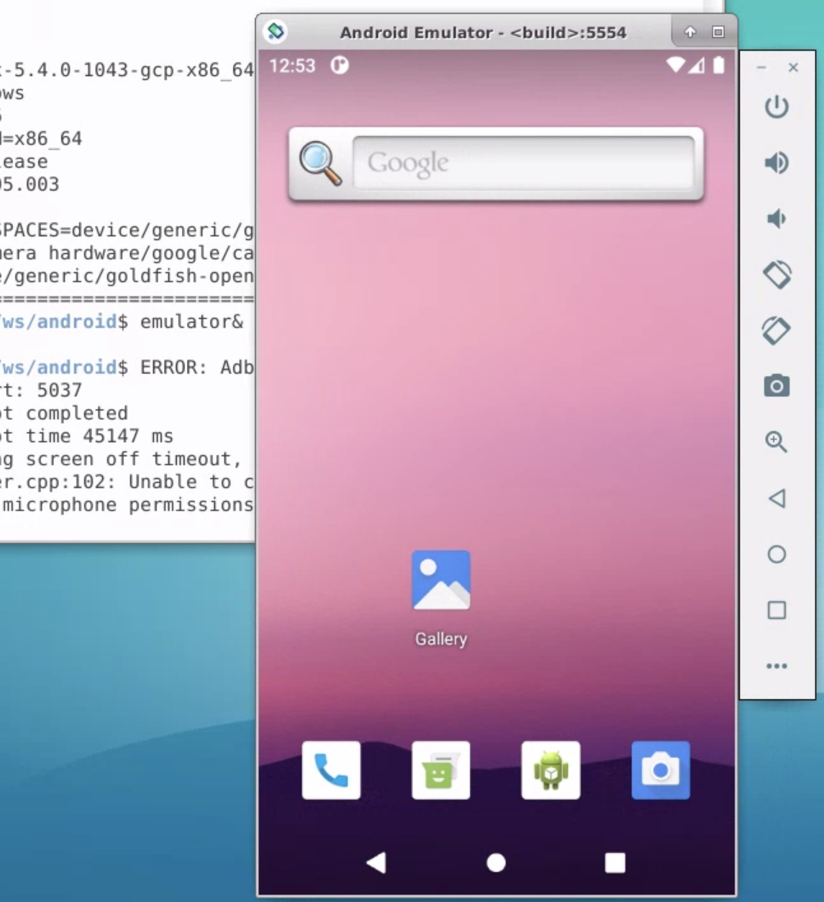

# Build An Android Virtual Device On The Cloud
In this clode lab, you will learn how to build an Android Virtual Device(AVD),
sdk_phone_x86_64 on the cloud.

## Android build process in a nutshell


## Android source code
Glancing through following pointers will give you a sense of Android codebase &
development universe.
- To navigate the codebase: [Android Code Search](https://cs.android.com/)
  - Search: **sdk_phone_x86_64.mk**
- The code & revision management: [Android Software Management](https://source.android.com/setup/start/codelines)
- Check Android & Pixel SW releases: [Codenames, Tags, and Build Numbers](https://source.android.com/setup/start/build-numbers)
- Understand [Source Control Workflow](https://source.android.com/setup/create/coding-tasks)


### Download Android source code
1. Pick an branch from [AOSP branch list](https://android.googlesource.com/platform/manifest/+refs).
2. Read [Downloading the Source](https://source.android.com/setup/build/downloading)
to learn more.
3. A typical download flow for **android11-qpr2-release**.
    - This will take a long time to sync. To save time, follow the next step.
    ```
    mkdir -p $HOME/ws/android
    cd $HOME/ws/android
    repo init -u https://android.googlesource.com/platform/manifest -b android11-qpr2-release
    repo sync -j16
    ```

4. For a quickstart, use **/ws/android** in the codelab1 VM, **asd-vm1**.
    - **/ws/android** has android11-qpr2-release downloaded in the custom
    image.
    - You don't need to do this, but just for fun, you may re-sync it. It'll
    only take about 5 min. to re-sync.
    ```
    cd /ws/android
    repo sync -j16
    ```

## Build sdk_phone_x86_64 AVD
1. Read [Building Android](https://source.android.com/setup/build/building) to
know more details.

2. A quickstart to build sdk_phon_x86_64 AVD.
    - It may take more than 2 hours to build it from the scratch.
    - To save time, you can use a prebuilt in **/ws/android**. Which only takes
    about 40 min. to rebuild.
    - Note: the 1st **lunch** can take a few min. for each new VM.
```
echo "Set android folder"
export ANDROID_BUILD_TOP="/ws/android"
cd ${ANDROID_BUILD_TOP}

echo "Set up Android build environment"
. build/envsetup.sh

echo "Select a target"
lunch sdk_phone_x86_64-userdebug

echo "Build the target"
m -j16

echo "Run it"
emulator &
```


## Poke aound
Android Emulator provides many useful controls for you to play around an AVD,
such as:
- [Perform common actions in the emulator](https://developer.android.com/studio/run/emulator#tasks)
- Explore [Extened Control](https://developer.android.com/studio/run/emulator#extended)
- Use [Android Debug Bridge](https://developer.android.com/studio/command-line/adb)
to check the AVD, e.g.
  ```
  adb devices
  adb reboot
  adb shell top
  ```
## Extra credits

### Start Android Emulator differently
- [Start the emulator from the command line](https://developer.android.com/studio/run/emulator-commandline)
- e.g. try to disable the [Quick Boot](https://developer.android.com/studio/run/emulator#quickboot)
feature & increase RAM. Check if the AVD runs quicker.
    ```
    emulator -no-snapshot -memory 4096 &
    ```

### Install an app
- Read [Installing an app](https://developer.android.com/studio/run/emulator-commandline#apps).
- Download a sample app APK from [Jetpack Compose Samples](https://github.com/android/compose-samples#jetpack-compose-samples)
to ~/Downloads, e.g. [jetsnack-debug.apk](https://github.com/android/compose-samples/releases/tag/v1.0.0-beta07).
- Install it by adb command-line & start it in the AVD.
    ```
    adb install $HOME/Downloads/jetsnack-debug.apk
    ```

