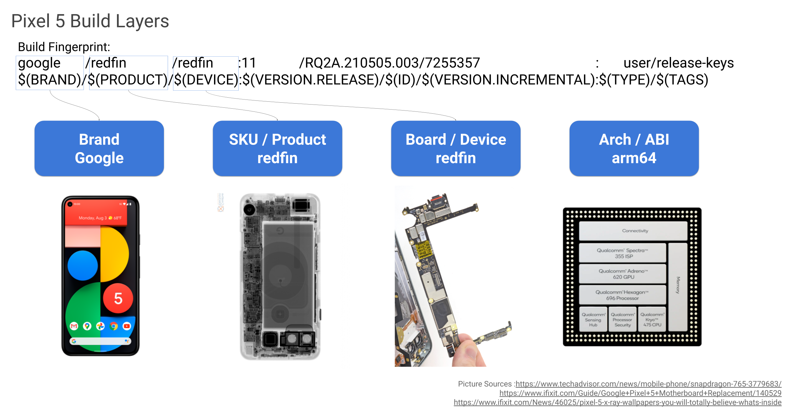
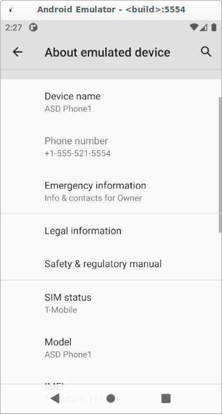
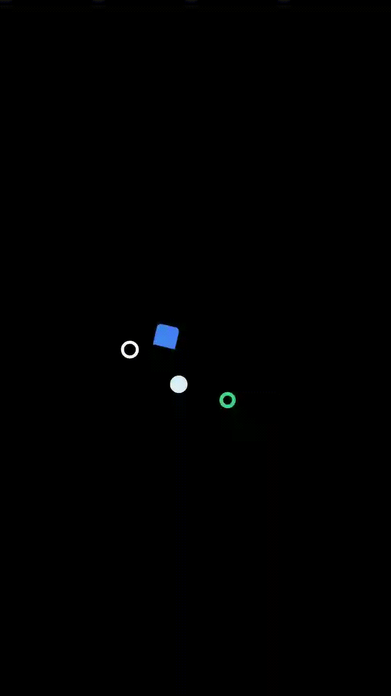

# Create Your Own AVD On The Cloud
In this code lab, you will learn how to create a new AVD target and change its
boot animation.

## Android build anatomy

1. [Understanding build layers](https://source.android.com/setup/develop/new-device#build-layers)
2. [Build parameters & fingerprint](https://source.android.com/compatibility/android-cdd#3_2_2_build_parameters)
3. [Pixel 5 build make files](https://cs.android.com/android/platform/superproject/+/master:device/google/redfin/)
4. [Nexus & Pixel factory images](https://developers.google.com/android/images#redfin)

## Create your own AVD
1. Create your company & device folders: ${ANDROID_BUILD_TOP}/asd/aphone
```
echo "Set to the android source code folder"
export ANDROID_BUILD_TOP="/ws/android"
mkdir -p ${ANDROID_BUILD_TOP}/asd/aphone
```

2. Create [AndroidProducts.mk](res/asd/AndroidProducts.mk) file for Android
Build System to know your build target.
3. Create [aphone.mk](res/asd/aphone/aphone.mk) to configure your build target.
4. Create [aphone_product.mk](res/asd/aphone/aphone_product.mk) for the product
specific build configuration.
5. Create [aphone.sh](res/asd/aphone.sh), development utility scripts to make
your life a bit easier.

```
echo "Copy make files & scripts from codelab3"
cp -r /ws/asd-codelabs/codelab3/res/asd ${ANDROID_BUILD_TOP}/device/asd

echo "Build it by the script"
cd ${ANDROID_BUILD_TOP}
device/asd/aphone.sh build

echo "Start your AVD"
emulator &

device/asd/aphone.sh info
```

5. Check the build fingerprint & Settings -> About emulated device for aphone.
```
adb shell getprop | grep finger
```



## Change the boot animation
Most device makers will add their own boot animation for their brands. You can
make your own too as:

1. Understand how [Android bootanimation](https://android.googlesource.com/platform/frameworks/base/+/master/cmds/bootanimation/FORMAT.md)
is built.

2. Add aphone specific bootanimation.zip, e.g.
```
mkdir -p ${ANDROID_BUILD_TOP}/device/asd/aphone/bootanimations
echo "Copy ATV boot animzation for example"
cp ${ANDROID_BUILD_TOP}/device/google/atv/products/bootanimations/bootanimation.zip \
   ${ANDROID_BUILD_TOP}/device/asd/aphone/bootanimations/bootanimation-atv.zip
```

3. Add it to the makefile, $ANDROID_BUILD_TOP/device/asd/aphone/aphone.mk, e.g.
```
# Boot animation
PRODUCT_COPY_FILES += \
    device/asd/aphone/bootanimations/bootanimation-atv.zip:$(TARGET_COPY_OUT_PRODUCT)/media/bootanimation.zip
```

4. Build & Run the AVD to check the new ATV animation.


## Preload an app
Device makers typically add preload apps to extend the core user experience for
their devices. This example shows you how to add a prebuilt app to aphone.
1. Download a sample app APK from [Jetpack Compose Samples](https://github.com/android/compose-samples#jetpack-compose-samples)
to ~/Downloads, e.g. [jetsnack-debug.apk](https://github.com/android/compose-samples/releases/tag/v1.0.0-beta07).

2. Copy the APK to aphone folder.
```
mkdir ${ANDROID_BUILD_TOP}/device/asd/apps
cp  ${HOME}/Downloads/jetsnack-debug.apk ${ANDROID_BUILD_TOP}/device/asd/apps
```

3. Create an Android.mk make file for the app in ${ANDROID_BUILD_TOP}/device/asd/apps.
```
#Prebuilt apps for ASD

LOCAL_PATH := $(my-dir)

include $(CLEAR_VARS)

LOCAL_MODULE := jetsnack
LOCAL_MODULE_CLASS := APPS
LOCAL_MODULE_TAGS := optional
LOCAL_CERTIFICATE := PRESIGNED
LOCAL_PRODUCT_MODULE := true
LOCAL_SRC_FILES := jetsnack-debug.apk

include $(BUILD_PREBUILT)
```
4. Add the app into aphone, aphone_product.mk in ${ANDROID_BUILD_TOP}/device/asd/aphone.
```
# ASD aphone apps
PRODUCT_PACKAGES += \
		jetsnack
```
5. Build & run to check out Jetsnack app is preloaded.


## Extra credits
1. What are the [Android device storage partitions](https://source.android.com/devices/bootloader/partitions)?
2. What are the [Android images](https://source.android.com/devices/bootloader/images)?
3. You can build for Smarter Cars too: [Android Virtual Device as a Development
Platform](https://source.android.com/devices/automotive/start/avd?hl=en)

