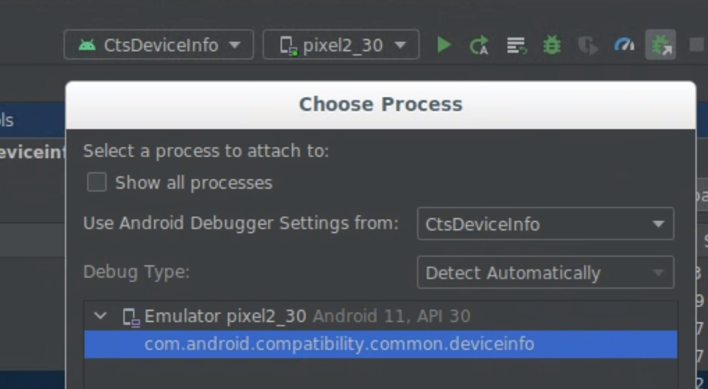
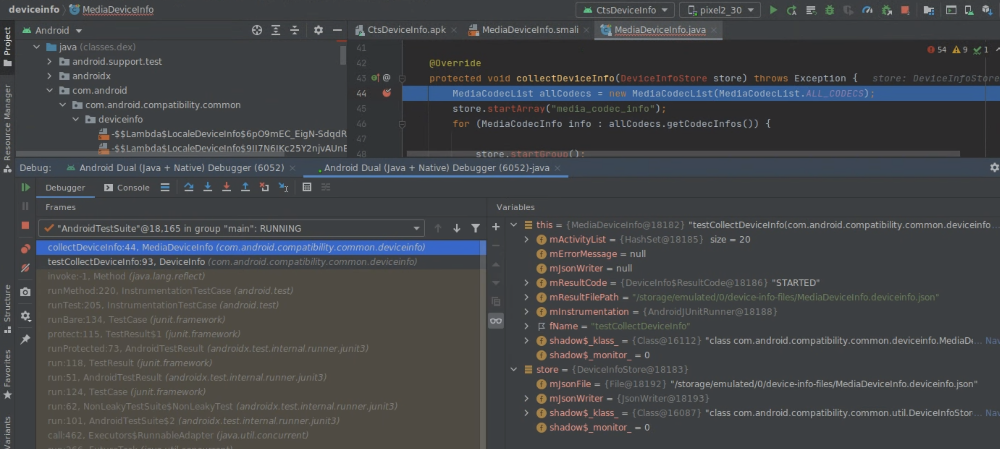

# Build and Debug Android CTS

In this code lab, you will learn how to build & debug CTS. But, why do you care?

tl;dr Android Open-Source Project (AOSP) empowers anyone to build their flavors
of Android devices without asking for permission. However, this creates problems
as anyone may make mistakes in their device implementations. Those may break
3rd Android party apps, and only be discovered much lather by users running apps.
Therefore, Android Compatibility Test Suite, [CTS](https://source.android.com/compatibility/overview)
is used to help device developers to validate if a device can run Android apps
properly.

## 1. Build & Run CTS

### 1a. Build

To CTS under the Android source directory, e.g.:
```
cd /ws/android && . build/envsetup.sh && lunch sdk_phone_x86_64-userdebug
make cts -j8

```

- Workaround a build error in the assist test module by removing it from CTS.
Edit it by `code /ws/android/cts/tests/tests/assist/Android.bp` as:

```
     test_suites: [
-        "cts",
+        //"cts",
```

### 1b. Run

To run a CTS test module: SignatureTest#testSignature
```
cts-tradefed run cts -m CtsCurrentApiSignatureTestCases -t android.signature.cts.api.SignatureTest#testSignature
```

### 1c. Check the report & log
Todo

### 1d. To learn more
- [CTS Development](https://source.android.com/compatibility/cts/development)
- [Running CTS tests](https://source.android.com/compatibility/cts/run)

## 2. Debug a CTS test case with Android Studio
There are more than a million test cases in CTS. And debugging them can be
very difficult & time-consuming even for seasonal engineers. Android Studio has
a user-friendly GUI to make it easier for app developers. As most CTS test modules
are just a special kind of "app/APK", you can use Android Studio to increase
your productivity on debugging or even rationalizing the code in concern.

### 2a. Typical debug workflow
A typically debug cycle is hypothesizing, adding logs, building, testing &
repeat. When you suspect or need to know more about a piece of code, you can
follow these steps to inspect the execution step by step. For example for
testSignature:

#### 2a1. Create a project
Todo

#### 2a2. Set breakpoints
Todo

#### 2a3. Run the test for debugging
Todo

#### 2a4. Step through & inspect
Todo

### 2b. A Special Case Study

This is a real case from an device maker could not figuer out why CTS failed to
collect device information on their AVD. Even though the physical device does
not have the problem. These are the steps to pin pointed the problem.

#### 2b1. The problem

CTS uses CtsDeviceInfo.apk to collect various device info before running any
test. Even CtsDeviceInfo is not an regular test module, it's important because
it collect key device information,such as Media features & capabilities of the
device under test in the test report. On the offending device:

- CTS fails on Instrumentation run failed due to 'Process crashed' for MediaDeviceInfo.
- MediaDeviceInfo.deviceinfo.json is empty & other important device information
is not collected.

#### 2b2. Debug the app

In order to debug CtsDeviceInfo.apk, you needs to be able to build or aquire
debugable apk. This is a security feature built in Android. If an app is not
debuggable, Android Studio will show the error: **This device cannot
be debugged using the native debugger**.

1. To build a debugable CtsDeviceInfo.apk, make ManifestGenerator.java tool to generate the debuggable apk manifist file. Edit it by `code /ws/android/test/suite_harness/common/host-side/manifest-generator/src/com/android/compatibility/common/generator/ManifestGenerator.java` as:
```
    serializer.startTag(ns, APPLICATION);
+    serializer.attribute(ns, "android:debuggable", "true");
    for (String library : libraries) {
```

- Learn more at [Android Manifest Application Element](https://developer.android.com/guide/topics/manifest/application-element).
- Note CtsDeviceInfo.apk uses this tool to generate AndroidManifest.xml at the build time.

1. Build CTS as usual

2. Open the APK in Android Studio
- Android Studio -> **Profile or Debug APK** -> /ws/android/out/host/linux-x86/cts/android-cts/testcases/CtsDeviceInfo.apk

1. Start an AVD as a device under test

2. Install the APK manually
```
adb install -g /ws/android/out/host/linux-x86/cts/android-cts/testcases/CtsDeviceInfo.apk
```

6. Start the app to wait for debugger
```
adb shell am instrument -e debug true  -w -r --no-isolated-storage -e newRunListenerMode true -e timeout_msec 300000 com.android.compatibility.common.deviceinfo/androidx.test.runner.AndroidJUnitRunner
```

7. Set a break point
- Open MediaDeviceInfo under: **1. Project** -> CtsDeviceInfo ->
com.android.compatibility.common.deviceinfo
- **Attach Kotlin/Java Sources...** ->
/ws/android/cts/common/device-side/device-info/src/com/android/compatibility/common/deviceinfo/MediaDeviceInfo.java
- Click the line 44 to set a break point
- Learn more in [Attach Kotlin/Java sources](https://developer.android.com/studio/debug/apk-debugger#attach_java)

8. Attach to the process
- Android Studio -> **Run** -> **Attach Debugger to Android Process...** ->
com.android.compatibility.common.deviceinfo -> **OK**



9.   Run & insepct
- Try & learn more in [Work with breakpoints](https://developer.android.com/studio/debug#breakPoints).



## 3. Extra Credits
todo
