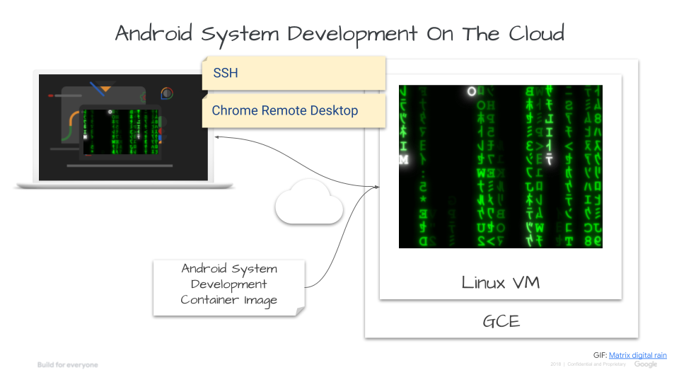

# Android System Development On Cloud Code Labs
This curates guides, code labs and resources to learn Android System
Development on the Cloud. So that, anyone can learn any aspect of A system
development by building an OS, an app framework & a device on a browser from
anywhere.

1. Why [AOSP](https://source.android.com/)?
  - Because the full stack of A system enables the permissionless innovation
   for anyone.
2. Why Android Virtual Device?
  - Because a high fidelity emulation tool removes HW barriers for rapid
   prototyping, fast iteration, easier automation & work from anywhere. A good
   way to leverage [the power of SoftWare-Defined](https://samlin001.medium.com/the-new-age-of-software-defined-2ae97c6d3281).
3. Why the Cloud?
  - Because it lowers cost of an expensive PC and the set up overhead. Any one
   only need a browser to get started. It's also quick to set up different dev
   environments for tasks working in parallel, or to ramp up a big team.

## Code Labs
1. [Set Up A System Development Environment on The Cloud](codelab1/README.md).
2. [Build An Android Virtual Device On The Cloud](codelab2/README.md).
3. [Create Your Own AVD On The Cloud](codelab3/README.md).
4. [Customize your own development environment](codelab4/README.md)

## Feedback & Known Issues
Your feedback & issues are welcome. Please check them out at [github.com/samlin001/asd-codelabs/issues](https://github.com/samlin001/asd-codelabs/issues)
 & [Create a new issue](https://github.com/samlin001/asd-codelabs/issues/new) as fit.

